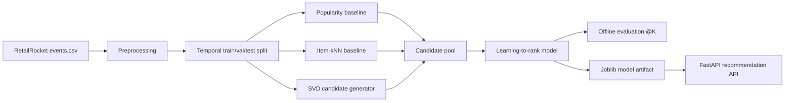

# E-commerce Recommender Ranking Service

Production-style recommendation system for implicit-feedback e-commerce events.

The project uses the public RetailRocket e-commerce dataset and follows a realistic offline ML lifecycle:
raw interactions -> preprocessing -> temporal split -> baselines -> two-stage recommendation -> offline evaluation -> model artifact -> FastAPI serving -> tests/CI.

## Dataset

**RetailRocket E-commerce Dataset**

- Source: https://www.kaggle.com/datasets/retailrocket/ecommerce-dataset
- Main file: `events.csv`
- Events: `view`, `addtocart`, `transaction`
- User key: `visitorid`
- Item key: `itemid`
- Timestamp: millisecond Unix timestamp

This is an implicit-feedback task. The model does not predict ratings; it recommends items based on user behavior.

Full experiment dataset after preprocessing:

| Events | Users | Items | Views | Add-to-cart | Transactions | Period |
| --- | --- | --- | --- | --- | --- | --- |
| 1,726,175 | 404,977 | 138,387 | 1,637,186 | 66,603 | 22,386 | 2015-05-03 to 2015-09-18 |

## ML Task

Recommend top-K items for a user, using only historical interactions available before the evaluation window.

Positive evaluation events:

- `addtocart`
- `transaction`

Views are used as weaker implicit signals during training, but add-to-cart and transaction events define stronger relevance for offline metrics.

## Architecture



## Models

- **Popularity baseline**: recommends globally popular items, excluding items already seen by the user.
- **Item-kNN baseline**: item-item collaborative filtering from co-occurrence in user histories.
- **SVD matrix factorization**: latent-factor candidate generation using sparse user-item interactions.
- **Two-stage ranker**: combines popularity, item-kNN, SVD score, and user-history features in a lightweight ranking model.

## Metrics

Offline ranking metrics are computed on users with positive validation/test events:

- `Precision@K`
- `Recall@K`
- `NDCG@K`
- `MAP@K`
- catalog coverage

No final RetailRocket metrics are committed until the full dataset experiment is actually run.

## Quickstart

```bash
python -m venv .venv
.venv\Scripts\activate
python -m pip install -e ".[train,dev]"
```

Create a tiny local sample for smoke testing:

```bash
make make-sample
make preprocess
make split
make train-baselines
make train-ranker
make evaluate
```

Run the API:

```bash
make serve
```

Request recommendations:

```bash
curl -X POST http://localhost:8000/recommend ^
  -H "Content-Type: application/json" ^
  -d "{\"user_id\": 1, \"k\": 10}"
```

## Full Dataset Run

Download from Kaggle with KaggleHub:

```bash
make install-train
make download
make preprocess
make split
make train-baselines
make train-ranker
make evaluate
```

MLflow tracking is enabled when `mlflow` is installed:

```bash
make mlflow-ui
```

## Experiment Results

Full RetailRocket run completed locally with temporal validation/test splitting.

Split summary:

| Split | Events | Time Window |
| --- | --- | --- |
| train | 1,428,607 | before 2015-08-21 |
| validation | 149,921 | 2015-08-21 to 2015-09-04 |
| test | 147,647 | 2015-09-04 to 2015-09-18 |

Leakage checks:

- train max timestamp before validation: passed
- validation max timestamp before test: passed

| Run | Split | Model | Precision@10 | Recall@10 | NDCG@10 | MAP@10 | Coverage | Status |
| --- | --- | --- | --- | --- | --- | --- | --- | --- |
| 001 | validation | popularity | 0.001655 | 0.011670 | 0.009153 | 0.007623 | 0.000249 | completed |
| 002 | validation | item-kNN | 0.000281 | 0.001270 | 0.000734 | 0.000411 | 0.023230 | completed |
| 003 | validation | SVD | 0.000140 | 0.000246 | 0.000259 | 0.000173 | 0.033877 | completed |
| 004 | validation | two-stage ranker | 0.001627 | 0.011766 | 0.005837 | 0.003571 | 0.033301 | completed |
| 005 | test | popularity | 0.001653 | 0.010394 | 0.008096 | 0.006257 | 0.000249 | completed |
| 006 | test | item-kNN | 0.000210 | 0.001295 | 0.000829 | 0.000581 | 0.018268 | completed |
| 007 | test | SVD | 0.000090 | 0.000270 | 0.000175 | 0.000078 | 0.026053 | completed |
| 008 | test | two-stage ranker | 0.000751 | 0.004479 | 0.002903 | 0.001964 | 0.025446 | completed |

### Result Interpretation

The popularity baseline is the strongest quality baseline in this first full run. This is common in sparse implicit-feedback e-commerce data: many users have short histories, and recent global popularity is a strong signal.

The two-stage ranker improves catalog coverage substantially compared with pure popularity, but loses NDCG/MAP on the test window. That makes it useful as an engineering baseline, not yet as the best production model. The next modeling iteration should add recency features, event-type sequence features, category/item metadata, and stronger validation-time negative sampling.

## Repository Layout

```text
configs/                 YAML configuration
data/raw/                raw dataset location, ignored by git
data/processed/          parquet splits, ignored by git
artifacts/               trained model artifacts, ignored by git
reports/                 generated metrics and summaries, ignored by git
src/recsys/api/          FastAPI app and Pydantic schemas
src/recsys/data/         download, preprocessing, sample data, split logic
src/recsys/evaluation/   ranking metrics
src/recsys/models/       recommenders and ranker
src/recsys/pipeline/     training/evaluation orchestration
tests/                   unit and integration tests
```

## Docker

```bash
docker build -t ecommerce-recsys-ranking-service .
docker run --rm -p 8000:8000 ecommerce-recsys-ranking-service
```

## Engineering Decisions

- Temporal split is used to avoid future-interaction leakage.
- Simple baselines are implemented before the ranker.
- Implicit feedback is weighted by event type.
- Model artifacts are serialized as full recommendation pipelines.
- API returns an explicit empty fallback response when no model artifact is available.
- CI keeps checks lightweight: linting plus deterministic tests.
